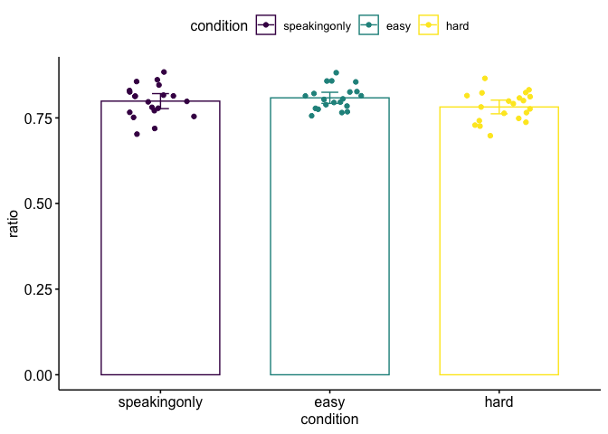
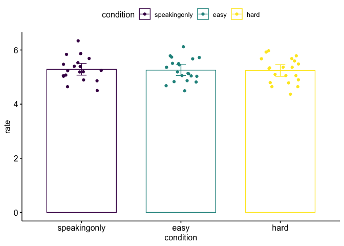
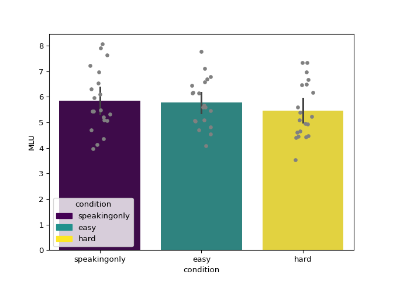
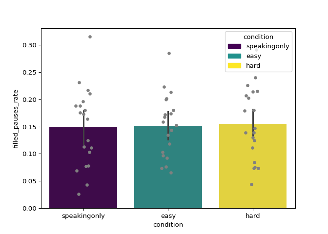
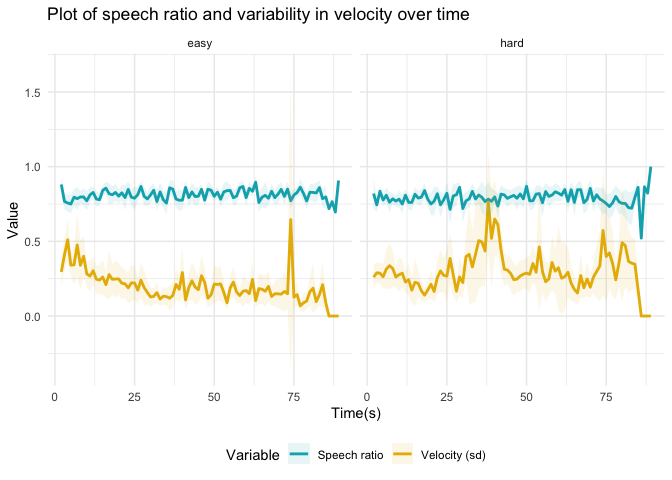
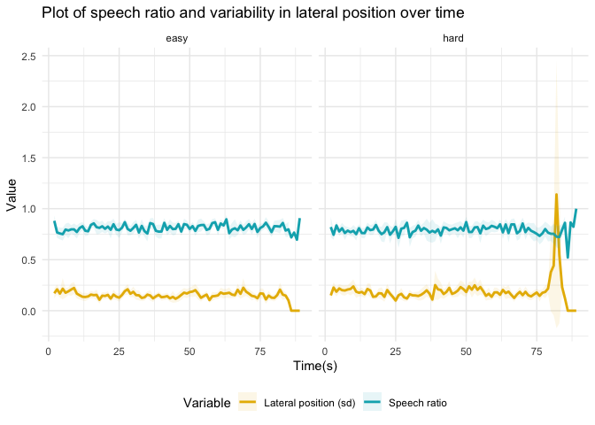

# Introduction

When driving a car, we often have conversations with passengers, and most of the time, both driving and speaking feel pretty automatic and easy. However, sometimes we have to allocate most if not all of our attention or other cognitive resources to driving if we want to avoid a collision. In those situations when the driving task becomes more difficult, drivers often become less fluent in their speech and may have to stop talking altogether. Many researchers think this has to do with the amount of cognitive resources we have available to us, and this suggests that we need resources like attention to be able to speak fluently. In the current study, we test whether speech fluency suffers when participants are simultaneously driving in a virtual reality driving simulator.

This document contains the R and Python code for data wrangling and analysis of an experiment. In this experiment, participants drove a car in a virtual reality driving simulator and completed speaking tasks while driving. The goal of the study was to test whether participants spoke less fluently while driving compared to when they were not driving. We also wanted to see if participants spoke less fluently in a harder driving condition than in an easy driving condition. 

For the analyses, we used a data type called the TextGrid, which is like a txt file but is able to be read into the software for speech analysis called Praat. TextGrids can be viewed along with a sound file so that we use the spectrogram and waveform to mark boundaries for each of the words, phonemes, or syllables that the speaker produced. The TextGrid has several tiers, which include boundaries for where words, phonemes, or syllables start and end. Here we used the python library praatio to read in TextGrids and pre-process the data.


```r
# load packages
library(phonfieldwork)
library(tidyverse)
library(data.table)
library(zoo)
library(plm)
library(ggthemes)
library(sjPlot)
library(ggpubr)
library(lme4)
library(kableExtra)
library(reticulate)
use_python("/Users/pamelafuhrmeister/opt/miniconda3/bin/python3")

# set plot theme
theme_set(theme_pubr(base_size = 14))
```

# Speech ratio

## Data wrangling


```r
# we want to read in textgrids as a data frame

# first make a list of textgrid files to read in
textgrid_files <- list.files(path = "../data/text_grids", 
                         pattern = "*.TextGrid", 
                         full.names = TRUE) %>%
  purrr::set_names()

# next apply the textgrid_to_df function to our list of files to read in and store as a data frame

# if you can't read in files, see if there are line breaks somewhere in the TextGrid!!
textgrids <- map_df(textgrid_files, textgrid_to_df)

# we want to separate the file name column (source) into two columns for the participant number and condition, so we first get rid of the file extension and unnecessary information in the file names
textgrids$source <- gsub("_corrected_syllables_pauses.TextGrid", "", textgrids$source)

# now we separate the column into two
textgrids <- textgrids %>% 
  separate(source, c("participant", "condition"))

# for this analysis, we only need the bell and participant (word boundary) tiers
speech_bell <- textgrids %>%
  filter(tier_name %in% c("Bell", "Participant"))

# now we want to subset to include times only between the start and end times (when the bell sounded for each participant and condition) because this is the only data we're going to analyze

# get a separate data frame with only the speaking condition; we will append the filtered data frames for each participant/condition to this one
df_all <- speech_bell %>% filter(condition == "speakingonly")

# subset the df to only include the driving conditions, since the time filtering does not apply to the speaking only condition; we will use this in the loops below
df_driving_only <- speech_bell %>%
  filter(condition != "speakingonly")

# this nested loop first subsets the data frame that contains only the driving conditions to each participant and condition
# then it finds the onset time of the start and end bells
# then it subsets the data frame to include only times within that interval
# last it appends the subsetted data frame to the df_all we defined above and removes everything we defined (just in case)
for (p in unique(df_driving_only$participant)){
  for (cond in unique(df_driving_only$condition)){
    df_sub <- df_driving_only %>% filter(participant == p, condition == cond)
    start_time <- df_sub[df_sub$tier_name == "Bell" & df_sub$time_start > 0,]$time_start[1]
    end_time <- df_sub[df_sub$tier_name == "Bell" & df_sub$time_start > 0,]$time_start[2]
    df_sub <- df_sub %>%
      filter(time_start >= start_time & time_start <= end_time)
    df_all <- rbind(df_all, df_sub)
    rm(df_sub)
    rm(start_time)
    rm(end_time)
  }
}

# first compute duration for each interval: end_time - start_time
# then filter out NA intervals (this is when the experimenter was talking)
speech_data <- df_all %>%
  filter(content != "NA" & tier_name == "Participant") %>%
  mutate(duration = time_end - time_start)
 
# speech ratio function
speech_ratio_func <- function(speaking, total){
  x <- speaking/total
  return(x)
}
 
# calculate the total speaking time, total time, and the speech ratio (speaking/total)
speech_ratio <- speech_data %>%
  group_by(participant, condition) %>%
  summarize(speaking = sum(duration[content!="xxx"]),
            total = sum(duration),
            ratio = speech_ratio_func(speaking, total))

# read in file with scores on cognitive tests
cogtests <- read.csv("../data/kognitive_tests.csv")
colnames(cogtests) <- c("participant", "digit_span_forwards", "digit_span_backwards", "number_symbol", "vocabulary")

# read in file for pdt scores
pdt <- read.csv("../data/pdt.csv")
pdt <- pdt[,-1]

speech_ratio <- merge(merge(speech_ratio, 
                      cogtests, 
                      by="participant"),
                      pdt,
                      by="participant")

# convert condition to a factor so we can set up coding scheme
speech_ratio$condition <- as.factor(speech_ratio$condition)

# set the speakingonly condition to the reference level so the contrasts we set will apply to the correct factor levels
speech_ratio$condition <- relevel(speech_ratio$condition, ref = "speakingonly")

# look at first rows of data frame
kbl(head(speech_ratio)) %>%
  kable_styling()
```

<table class="table" style="margin-left: auto; margin-right: auto;">
 <thead>
  <tr>
   <th style="text-align:left;"> participant </th>
   <th style="text-align:left;"> condition </th>
   <th style="text-align:right;"> speaking </th>
   <th style="text-align:right;"> total </th>
   <th style="text-align:right;"> ratio </th>
   <th style="text-align:right;"> digit_span_forwards </th>
   <th style="text-align:right;"> digit_span_backwards </th>
   <th style="text-align:right;"> number_symbol </th>
   <th style="text-align:right;"> vocabulary </th>
   <th style="text-align:right;"> NrStimuli </th>
   <th style="text-align:right;"> AvgPDT </th>
   <th style="text-align:right;"> FracMissed </th>
   <th style="text-align:right;"> AutomationIndex </th>
  </tr>
 </thead>
<tbody>
  <tr>
   <td style="text-align:left;"> 101 </td>
   <td style="text-align:left;"> easy </td>
   <td style="text-align:right;"> 268.5241 </td>
   <td style="text-align:right;"> 345.2148 </td>
   <td style="text-align:right;"> 0.7778463 </td>
   <td style="text-align:right;"> 10 </td>
   <td style="text-align:right;"> 8 </td>
   <td style="text-align:right;"> 83 </td>
   <td style="text-align:right;"> 25 </td>
   <td style="text-align:right;"> 46 </td>
   <td style="text-align:right;"> 0.57 </td>
   <td style="text-align:right;"> 0.02 </td>
   <td style="text-align:right;"> 91.88 </td>
  </tr>
  <tr>
   <td style="text-align:left;"> 101 </td>
   <td style="text-align:left;"> hard </td>
   <td style="text-align:right;"> 258.5444 </td>
   <td style="text-align:right;"> 345.3631 </td>
   <td style="text-align:right;"> 0.7486162 </td>
   <td style="text-align:right;"> 10 </td>
   <td style="text-align:right;"> 8 </td>
   <td style="text-align:right;"> 83 </td>
   <td style="text-align:right;"> 25 </td>
   <td style="text-align:right;"> 46 </td>
   <td style="text-align:right;"> 0.57 </td>
   <td style="text-align:right;"> 0.02 </td>
   <td style="text-align:right;"> 91.88 </td>
  </tr>
  <tr>
   <td style="text-align:left;"> 101 </td>
   <td style="text-align:left;"> speakingonly </td>
   <td style="text-align:right;"> 285.7271 </td>
   <td style="text-align:right;"> 370.5579 </td>
   <td style="text-align:right;"> 0.7710727 </td>
   <td style="text-align:right;"> 10 </td>
   <td style="text-align:right;"> 8 </td>
   <td style="text-align:right;"> 83 </td>
   <td style="text-align:right;"> 25 </td>
   <td style="text-align:right;"> 46 </td>
   <td style="text-align:right;"> 0.57 </td>
   <td style="text-align:right;"> 0.02 </td>
   <td style="text-align:right;"> 91.88 </td>
  </tr>
  <tr>
   <td style="text-align:left;"> 102 </td>
   <td style="text-align:left;"> easy </td>
   <td style="text-align:right;"> 243.2560 </td>
   <td style="text-align:right;"> 284.4631 </td>
   <td style="text-align:right;"> 0.8551409 </td>
   <td style="text-align:right;"> 8 </td>
   <td style="text-align:right;"> 6 </td>
   <td style="text-align:right;"> 94 </td>
   <td style="text-align:right;"> 31 </td>
   <td style="text-align:right;"> 44 </td>
   <td style="text-align:right;"> 0.42 </td>
   <td style="text-align:right;"> 0.00 </td>
   <td style="text-align:right;"> 98.92 </td>
  </tr>
  <tr>
   <td style="text-align:left;"> 102 </td>
   <td style="text-align:left;"> hard </td>
   <td style="text-align:right;"> 271.3622 </td>
   <td style="text-align:right;"> 326.1649 </td>
   <td style="text-align:right;"> 0.8319787 </td>
   <td style="text-align:right;"> 8 </td>
   <td style="text-align:right;"> 6 </td>
   <td style="text-align:right;"> 94 </td>
   <td style="text-align:right;"> 31 </td>
   <td style="text-align:right;"> 44 </td>
   <td style="text-align:right;"> 0.42 </td>
   <td style="text-align:right;"> 0.00 </td>
   <td style="text-align:right;"> 98.92 </td>
  </tr>
  <tr>
   <td style="text-align:left;"> 102 </td>
   <td style="text-align:left;"> speakingonly </td>
   <td style="text-align:right;"> 264.8305 </td>
   <td style="text-align:right;"> 320.7060 </td>
   <td style="text-align:right;"> 0.8257733 </td>
   <td style="text-align:right;"> 8 </td>
   <td style="text-align:right;"> 6 </td>
   <td style="text-align:right;"> 94 </td>
   <td style="text-align:right;"> 31 </td>
   <td style="text-align:right;"> 44 </td>
   <td style="text-align:right;"> 0.42 </td>
   <td style="text-align:right;"> 0.00 </td>
   <td style="text-align:right;"> 98.92 </td>
  </tr>
</tbody>
</table>

## Visualize data


```r
# make bar plot with individual data points
speech_ratio %>%
  ggbarplot(x = "condition", y = "ratio", 
       add = c("mean_ci", "jitter"),
       color = "condition", palette = c("#440154", "#21918c", "#fde725"))
```

<!-- -->

## Statistical models

### Helmert contrasts

In this analysis, we fit a logistic regression model to test our hypotheses about the differences in speech ratio across the conditions. We have three conditions: speaking only, easy driving, and hard driving, and we want to know whether there is a difference between the two driving conditions (easy and hard) and whether there is a difference between the speaking only conditions and the mean of the two driving conditions. We set up reverse Helmert coding for the factor condition to test these contrasts. The first contrast in reverse Helmert coding tests the difference between level 1 and level 2 of the factor (in this case hardeach level of the factor and the mean of the subsequent levels: (speaking only - mean(easy, hard); easy - mean(hard))


```r
# create our own Helmert contrasts because the output is easier to interpret
my.helmert = matrix(c(2/3, -1/3, -1/3, 0, 1/2, -1/2), ncol = 2)
contrasts(speech_ratio$condition) <- my.helmert

# check to make sure the contrasts are set up correctly
contrasts(speech_ratio$condition)
```

```
##                    [,1] [,2]
## speakingonly  0.6666667  0.0
## easy         -0.3333333  0.5
## hard         -0.3333333 -0.5
```

```r
# we also mean center the vocabulary and pdt scores
speech_ratio$vocabulary <- speech_ratio$vocabulary - mean(speech_ratio$vocabulary)
speech_ratio$AvgPDT <- speech_ratio$AvgPDT - mean(speech_ratio$AvgPDT)
```

#### Fit model


```r
# logistic regression model
m_ratio <- glmer(speaking/total ~ condition + vocabulary + AvgPDT + (1|participant),
                 data = speech_ratio,
                 family = "binomial",
                 weights = total)
```


##### Results table


```r
# define labels for predictor variables
pred_labels_helmert <- c("Intercept", 
                       "Speaking - driving", 
                       "Driving: easy - hard", 
                       "Vocabulary", "PDT")

# table
tab_model(
  m_ratio, 
  pred.labels = pred_labels_helmert,
  transform = NULL, 
  show.se=TRUE, 
  string.est = "Estimate", 
  string.se = "SE", 
  string.stat = "z",
  show.stat=TRUE, 
  show.ci = 0.95, 
  show.re.var=FALSE, 
  show.obs=FALSE, 
  emph.p = FALSE, 
  dv.labels = "Speech ratio: Helmert contrasts", 
  show.icc = FALSE, 
  show.r2 = FALSE
  )
```

<table style="border-collapse:collapse; border:none;">
<tr>
<th style="border-top: double; text-align:center; font-style:normal; font-weight:bold; padding:0.2cm;  text-align:left; ">&nbsp;</th>
<th colspan="5" style="border-top: double; text-align:center; font-style:normal; font-weight:bold; padding:0.2cm; ">Speech ratio: Helmert contrasts</th>
</tr>
<tr>
<td style=" text-align:center; border-bottom:1px solid; font-style:italic; font-weight:normal;  text-align:left; ">Predictors</td>
<td style=" text-align:center; border-bottom:1px solid; font-style:italic; font-weight:normal;  ">Estimate</td>
<td style=" text-align:center; border-bottom:1px solid; font-style:italic; font-weight:normal;  ">SE</td>
<td style=" text-align:center; border-bottom:1px solid; font-style:italic; font-weight:normal;  ">CI</td>
<td style=" text-align:center; border-bottom:1px solid; font-style:italic; font-weight:normal;  ">z</td>
<td style=" text-align:center; border-bottom:1px solid; font-style:italic; font-weight:normal;  ">p</td>
</tr>
<tr>
<td style=" padding:0.2cm; text-align:left; vertical-align:top; text-align:left; ">Intercept</td>
<td style=" padding:0.2cm; text-align:left; vertical-align:top; text-align:center;  ">1.38</td>
<td style=" padding:0.2cm; text-align:left; vertical-align:top; text-align:center;  ">0.05</td>
<td style=" padding:0.2cm; text-align:left; vertical-align:top; text-align:center;  ">1.28&nbsp;&ndash;&nbsp;1.48</td>
<td style=" padding:0.2cm; text-align:left; vertical-align:top; text-align:center;  ">27.32</td>
<td style=" padding:0.2cm; text-align:left; vertical-align:top; text-align:center;  ">&lt;0.001</td>
</tr>
<tr>
<td style=" padding:0.2cm; text-align:left; vertical-align:top; text-align:left; ">Speaking - driving</td>
<td style=" padding:0.2cm; text-align:left; vertical-align:top; text-align:center;  ">0.03</td>
<td style=" padding:0.2cm; text-align:left; vertical-align:top; text-align:center;  ">0.04</td>
<td style=" padding:0.2cm; text-align:left; vertical-align:top; text-align:center;  ">&#45;0.04&nbsp;&ndash;&nbsp;0.10</td>
<td style=" padding:0.2cm; text-align:left; vertical-align:top; text-align:center;  ">0.72</td>
<td style=" padding:0.2cm; text-align:left; vertical-align:top; text-align:center;  ">0.472</td>
</tr>
<tr>
<td style=" padding:0.2cm; text-align:left; vertical-align:top; text-align:left; ">Driving: easy - hard</td>
<td style=" padding:0.2cm; text-align:left; vertical-align:top; text-align:center;  ">0.16</td>
<td style=" padding:0.2cm; text-align:left; vertical-align:top; text-align:center;  ">0.04</td>
<td style=" padding:0.2cm; text-align:left; vertical-align:top; text-align:center;  ">0.08&nbsp;&ndash;&nbsp;0.25</td>
<td style=" padding:0.2cm; text-align:left; vertical-align:top; text-align:center;  ">3.87</td>
<td style=" padding:0.2cm; text-align:left; vertical-align:top; text-align:center;  ">&lt;0.001</td>
</tr>
<tr>
<td style=" padding:0.2cm; text-align:left; vertical-align:top; text-align:left; ">Vocabulary</td>
<td style=" padding:0.2cm; text-align:left; vertical-align:top; text-align:center;  ">0.02</td>
<td style=" padding:0.2cm; text-align:left; vertical-align:top; text-align:center;  ">0.02</td>
<td style=" padding:0.2cm; text-align:left; vertical-align:top; text-align:center;  ">&#45;0.02&nbsp;&ndash;&nbsp;0.06</td>
<td style=" padding:0.2cm; text-align:left; vertical-align:top; text-align:center;  ">1.12</td>
<td style=" padding:0.2cm; text-align:left; vertical-align:top; text-align:center;  ">0.265</td>
</tr>
<tr>
<td style=" padding:0.2cm; text-align:left; vertical-align:top; text-align:left; ">PDT</td>
<td style=" padding:0.2cm; text-align:left; vertical-align:top; text-align:center;  ">0.44</td>
<td style=" padding:0.2cm; text-align:left; vertical-align:top; text-align:center;  ">0.85</td>
<td style=" padding:0.2cm; text-align:left; vertical-align:top; text-align:center;  ">&#45;1.22&nbsp;&ndash;&nbsp;2.10</td>
<td style=" padding:0.2cm; text-align:left; vertical-align:top; text-align:center;  ">0.52</td>
<td style=" padding:0.2cm; text-align:left; vertical-align:top; text-align:center;  ">0.605</td>
</tr>

<tr>
<td style=" padding:0.2cm; text-align:left; vertical-align:top; text-align:left; padding-top:0.1cm; padding-bottom:0.1cm;">N <sub>participant</sub></td>
<td style=" padding:0.2cm; text-align:left; vertical-align:top; padding-top:0.1cm; padding-bottom:0.1cm; text-align:left;" colspan="5">20</td>

</table>


### Treatment contrasts (exploratory)

As an exploratory analysis, we want to see if either driving condition (easy or hard) significantly differs from the speaking only condition. To do this, we treatment coded (or dummy coded) the factor of condition with speaking only as the reference level. 


```r
# assign treatment contrasts
contrasts(speech_ratio$condition) <- contr.treatment(3)

# check to make sure the contrasts are set up correctly
contrasts(speech_ratio$condition)
```

```
##              2 3
## speakingonly 0 0
## easy         1 0
## hard         0 1
```

#### Fit model


```r
# logistic regression model
m_ratio_trt <- glmer(speaking/total ~ condition + vocabulary + AvgPDT + (1|participant),
                 data = speech_ratio,
                 family = "binomial",
                 weights = total)
```


##### Results table


```r
# define labels for predictor variables
pred_labels_treatment <- c("Intercept", 
                       "Easy driving - Speaking", 
                       "Hard driving - Speaking", 
                       "Vocabulary", "PDT")

# table
tab_model(
  m_ratio_trt, 
  pred.labels = pred_labels_treatment,
  transform = NULL, 
  show.se=TRUE, 
  string.est = "Estimate", 
  string.se = "SE", 
  string.stat = "z",
  show.stat=TRUE, 
  show.ci = 0.95, 
  show.re.var=FALSE, 
  show.obs=FALSE, 
  emph.p = FALSE, 
  dv.labels = "Speech ratio: treatment contrasts", 
  show.icc = FALSE, 
  show.r2 = FALSE
  )
```

<table style="border-collapse:collapse; border:none;">
<tr>
<th style="border-top: double; text-align:center; font-style:normal; font-weight:bold; padding:0.2cm;  text-align:left; ">&nbsp;</th>
<th colspan="5" style="border-top: double; text-align:center; font-style:normal; font-weight:bold; padding:0.2cm; ">Speech ratio: treatment contrasts</th>
</tr>
<tr>
<td style=" text-align:center; border-bottom:1px solid; font-style:italic; font-weight:normal;  text-align:left; ">Predictors</td>
<td style=" text-align:center; border-bottom:1px solid; font-style:italic; font-weight:normal;  ">Estimate</td>
<td style=" text-align:center; border-bottom:1px solid; font-style:italic; font-weight:normal;  ">SE</td>
<td style=" text-align:center; border-bottom:1px solid; font-style:italic; font-weight:normal;  ">CI</td>
<td style=" text-align:center; border-bottom:1px solid; font-style:italic; font-weight:normal;  ">z</td>
<td style=" text-align:center; border-bottom:1px solid; font-style:italic; font-weight:normal;  ">p</td>
</tr>
<tr>
<td style=" padding:0.2cm; text-align:left; vertical-align:top; text-align:left; ">Intercept</td>
<td style=" padding:0.2cm; text-align:left; vertical-align:top; text-align:center;  ">1.40</td>
<td style=" padding:0.2cm; text-align:left; vertical-align:top; text-align:center;  ">0.06</td>
<td style=" padding:0.2cm; text-align:left; vertical-align:top; text-align:center;  ">1.29&nbsp;&ndash;&nbsp;1.51</td>
<td style=" padding:0.2cm; text-align:left; vertical-align:top; text-align:center;  ">25.11</td>
<td style=" padding:0.2cm; text-align:left; vertical-align:top; text-align:center;  ">&lt;0.001</td>
</tr>
<tr>
<td style=" padding:0.2cm; text-align:left; vertical-align:top; text-align:left; ">Easy driving - Speaking</td>
<td style=" padding:0.2cm; text-align:left; vertical-align:top; text-align:center;  ">0.06</td>
<td style=" padding:0.2cm; text-align:left; vertical-align:top; text-align:center;  ">0.04</td>
<td style=" padding:0.2cm; text-align:left; vertical-align:top; text-align:center;  ">&#45;0.03&nbsp;&ndash;&nbsp;0.14</td>
<td style=" padding:0.2cm; text-align:left; vertical-align:top; text-align:center;  ">1.33</td>
<td style=" padding:0.2cm; text-align:left; vertical-align:top; text-align:center;  ">0.184</td>
</tr>
<tr>
<td style=" padding:0.2cm; text-align:left; vertical-align:top; text-align:left; ">Hard driving - Speaking</td>
<td style=" padding:0.2cm; text-align:left; vertical-align:top; text-align:center;  ">&#45;0.11</td>
<td style=" padding:0.2cm; text-align:left; vertical-align:top; text-align:center;  ">0.04</td>
<td style=" padding:0.2cm; text-align:left; vertical-align:top; text-align:center;  ">&#45;0.19&nbsp;&ndash;&nbsp;-0.03</td>
<td style=" padding:0.2cm; text-align:left; vertical-align:top; text-align:center;  ">&#45;2.62</td>
<td style=" padding:0.2cm; text-align:left; vertical-align:top; text-align:center;  ">0.009</td>
</tr>
<tr>
<td style=" padding:0.2cm; text-align:left; vertical-align:top; text-align:left; ">Vocabulary</td>
<td style=" padding:0.2cm; text-align:left; vertical-align:top; text-align:center;  ">0.02</td>
<td style=" padding:0.2cm; text-align:left; vertical-align:top; text-align:center;  ">0.02</td>
<td style=" padding:0.2cm; text-align:left; vertical-align:top; text-align:center;  ">&#45;0.02&nbsp;&ndash;&nbsp;0.06</td>
<td style=" padding:0.2cm; text-align:left; vertical-align:top; text-align:center;  ">1.12</td>
<td style=" padding:0.2cm; text-align:left; vertical-align:top; text-align:center;  ">0.265</td>
</tr>
<tr>
<td style=" padding:0.2cm; text-align:left; vertical-align:top; text-align:left; ">PDT</td>
<td style=" padding:0.2cm; text-align:left; vertical-align:top; text-align:center;  ">0.44</td>
<td style=" padding:0.2cm; text-align:left; vertical-align:top; text-align:center;  ">0.85</td>
<td style=" padding:0.2cm; text-align:left; vertical-align:top; text-align:center;  ">&#45;1.22&nbsp;&ndash;&nbsp;2.10</td>
<td style=" padding:0.2cm; text-align:left; vertical-align:top; text-align:center;  ">0.52</td>
<td style=" padding:0.2cm; text-align:left; vertical-align:top; text-align:center;  ">0.605</td>
</tr>

<tr>
<td style=" padding:0.2cm; text-align:left; vertical-align:top; text-align:left; padding-top:0.1cm; padding-bottom:0.1cm;">N <sub>participant</sub></td>
<td style=" padding:0.2cm; text-align:left; vertical-align:top; padding-top:0.1cm; padding-bottom:0.1cm; text-align:left;" colspan="5">20</td>

</table>


# Speaking rate

## Data wrangling


```r
# subset main textgrids data frame to only include syllable tier
# filter out NA intervals (this is when the experimenter was talking)
# compute duration for each interval: end_time - start_time
syllable_data <- textgrids %>%
  filter(tier_name == "syllables", content != "NA") %>%
  mutate(duration = time_end - time_start)

# calculate the total number of syllables, total time, and speaking rate (syllables/second)

speaking_rate <- syllable_data %>%
  group_by(participant, condition) %>%
  filter(content!="xxx" & content!="" & content != "PRAG" & content != "NA") %>%
  summarize(syllables = n(),
            total = sum(duration),
            rate = syllables/total)

speaking_rate <- merge(merge(speaking_rate, 
                             cogtests, 
                             by="participant"),
                       pdt,
                       by="participant")

# convert condition to a factor so we can set up coding scheme
speaking_rate$condition <- as.factor(speaking_rate$condition)

# set the speakingonly condition to the reference level so the contrasts will apply to the correct factor levels
speaking_rate$condition <- relevel(speaking_rate$condition, ref = "speakingonly")


# look at first rows of data frame
kbl(head(speaking_rate)) %>%
  kable_styling()
```

<table class="table" style="margin-left: auto; margin-right: auto;">
 <thead>
  <tr>
   <th style="text-align:left;"> participant </th>
   <th style="text-align:left;"> condition </th>
   <th style="text-align:right;"> syllables </th>
   <th style="text-align:right;"> total </th>
   <th style="text-align:right;"> rate </th>
   <th style="text-align:right;"> digit_span_forwards </th>
   <th style="text-align:right;"> digit_span_backwards </th>
   <th style="text-align:right;"> number_symbol </th>
   <th style="text-align:right;"> vocabulary </th>
   <th style="text-align:right;"> NrStimuli </th>
   <th style="text-align:right;"> AvgPDT </th>
   <th style="text-align:right;"> FracMissed </th>
   <th style="text-align:right;"> AutomationIndex </th>
  </tr>
 </thead>
<tbody>
  <tr>
   <td style="text-align:left;"> 101 </td>
   <td style="text-align:left;"> easy </td>
   <td style="text-align:right;"> 1358 </td>
   <td style="text-align:right;"> 246.6552 </td>
   <td style="text-align:right;"> 5.505661 </td>
   <td style="text-align:right;"> 10 </td>
   <td style="text-align:right;"> 8 </td>
   <td style="text-align:right;"> 83 </td>
   <td style="text-align:right;"> 25 </td>
   <td style="text-align:right;"> 46 </td>
   <td style="text-align:right;"> 0.57 </td>
   <td style="text-align:right;"> 0.02 </td>
   <td style="text-align:right;"> 91.88 </td>
  </tr>
  <tr>
   <td style="text-align:left;"> 101 </td>
   <td style="text-align:left;"> hard </td>
   <td style="text-align:right;"> 1348 </td>
   <td style="text-align:right;"> 237.2410 </td>
   <td style="text-align:right;"> 5.681985 </td>
   <td style="text-align:right;"> 10 </td>
   <td style="text-align:right;"> 8 </td>
   <td style="text-align:right;"> 83 </td>
   <td style="text-align:right;"> 25 </td>
   <td style="text-align:right;"> 46 </td>
   <td style="text-align:right;"> 0.57 </td>
   <td style="text-align:right;"> 0.02 </td>
   <td style="text-align:right;"> 91.88 </td>
  </tr>
  <tr>
   <td style="text-align:left;"> 101 </td>
   <td style="text-align:left;"> speakingonly </td>
   <td style="text-align:right;"> 1453 </td>
   <td style="text-align:right;"> 262.6682 </td>
   <td style="text-align:right;"> 5.531693 </td>
   <td style="text-align:right;"> 10 </td>
   <td style="text-align:right;"> 8 </td>
   <td style="text-align:right;"> 83 </td>
   <td style="text-align:right;"> 25 </td>
   <td style="text-align:right;"> 46 </td>
   <td style="text-align:right;"> 0.57 </td>
   <td style="text-align:right;"> 0.02 </td>
   <td style="text-align:right;"> 91.88 </td>
  </tr>
  <tr>
   <td style="text-align:left;"> 102 </td>
   <td style="text-align:left;"> easy </td>
   <td style="text-align:right;"> 1130 </td>
   <td style="text-align:right;"> 234.5547 </td>
   <td style="text-align:right;"> 4.817640 </td>
   <td style="text-align:right;"> 8 </td>
   <td style="text-align:right;"> 6 </td>
   <td style="text-align:right;"> 94 </td>
   <td style="text-align:right;"> 31 </td>
   <td style="text-align:right;"> 44 </td>
   <td style="text-align:right;"> 0.42 </td>
   <td style="text-align:right;"> 0.00 </td>
   <td style="text-align:right;"> 98.92 </td>
  </tr>
  <tr>
   <td style="text-align:left;"> 102 </td>
   <td style="text-align:left;"> hard </td>
   <td style="text-align:right;"> 1237 </td>
   <td style="text-align:right;"> 266.2885 </td>
   <td style="text-align:right;"> 4.645337 </td>
   <td style="text-align:right;"> 8 </td>
   <td style="text-align:right;"> 6 </td>
   <td style="text-align:right;"> 94 </td>
   <td style="text-align:right;"> 31 </td>
   <td style="text-align:right;"> 44 </td>
   <td style="text-align:right;"> 0.42 </td>
   <td style="text-align:right;"> 0.00 </td>
   <td style="text-align:right;"> 98.92 </td>
  </tr>
  <tr>
   <td style="text-align:left;"> 102 </td>
   <td style="text-align:left;"> speakingonly </td>
   <td style="text-align:right;"> 1303 </td>
   <td style="text-align:right;"> 259.0216 </td>
   <td style="text-align:right;"> 5.030468 </td>
   <td style="text-align:right;"> 8 </td>
   <td style="text-align:right;"> 6 </td>
   <td style="text-align:right;"> 94 </td>
   <td style="text-align:right;"> 31 </td>
   <td style="text-align:right;"> 44 </td>
   <td style="text-align:right;"> 0.42 </td>
   <td style="text-align:right;"> 0.00 </td>
   <td style="text-align:right;"> 98.92 </td>
  </tr>
</tbody>
</table>

## Visualize data


```r
# make bar plot with individual data points
speaking_rate %>%
  ggbarplot(x = "condition", y = "rate",
       add = c("mean_ci", "jitter"),
       color = "condition", palette = c("#440154", "#21918c", "#fde725"))
```

<!-- -->


## Statistical models

### Helmert contrasts

In this model, we test our hypotheses about the differences in speaking rate across the conditions. We again set up Helmert coding for the factor condition to test these contrasts: (speaking only - mean(easy, hard); easy - mean(hard))


```r
# assign Helmert contrasts to condition
contrasts(speaking_rate$condition) <- my.helmert

# check to make sure the contrasts look right
contrasts(speaking_rate$condition)
```

```
##                    [,1] [,2]
## speakingonly  0.6666667  0.0
## easy         -0.3333333  0.5
## hard         -0.3333333 -0.5
```

```r
# we also mean center vocabulary
speaking_rate$vocabulary <- speaking_rate$vocabulary - mean(speaking_rate$vocabulary)
speaking_rate$AvgPDT <- speaking_rate$AvgPDT - mean(speaking_rate$AvgPDT)
```

#### Fit model


```r
# regression model
m_rate <- glmer(syllables ~ condition + vocabulary + AvgPDT + (1|participant),
                data = speaking_rate,
                family = "poisson",
                offset = log(total))
```


#### Results table


```r
# table
tab_model(
  m_rate, 
  pred.labels = pred_labels_helmert,
  transform = NULL, 
  show.se=TRUE, 
  string.est = "Estimate", 
  string.se = "SE", 
  string.stat = "z",
  show.stat=TRUE, 
  show.ci = 0.95, 
  show.re.var=FALSE, 
  show.obs=FALSE, 
  emph.p = FALSE, 
  dv.labels = "Speaking rate", 
  show.icc = FALSE, 
  show.r2 = FALSE
  )
```

<table style="border-collapse:collapse; border:none;">
<tr>
<th style="border-top: double; text-align:center; font-style:normal; font-weight:bold; padding:0.2cm;  text-align:left; ">&nbsp;</th>
<th colspan="5" style="border-top: double; text-align:center; font-style:normal; font-weight:bold; padding:0.2cm; ">Speaking rate</th>
</tr>
<tr>
<td style=" text-align:center; border-bottom:1px solid; font-style:italic; font-weight:normal;  text-align:left; ">Predictors</td>
<td style=" text-align:center; border-bottom:1px solid; font-style:italic; font-weight:normal;  ">Estimate</td>
<td style=" text-align:center; border-bottom:1px solid; font-style:italic; font-weight:normal;  ">SE</td>
<td style=" text-align:center; border-bottom:1px solid; font-style:italic; font-weight:normal;  ">CI</td>
<td style=" text-align:center; border-bottom:1px solid; font-style:italic; font-weight:normal;  ">z</td>
<td style=" text-align:center; border-bottom:1px solid; font-style:italic; font-weight:normal;  ">p</td>
</tr>
<tr>
<td style=" padding:0.2cm; text-align:left; vertical-align:top; text-align:left; ">Intercept</td>
<td style=" padding:0.2cm; text-align:left; vertical-align:top; text-align:center;  ">1.66</td>
<td style=" padding:0.2cm; text-align:left; vertical-align:top; text-align:center;  ">0.02</td>
<td style=" padding:0.2cm; text-align:left; vertical-align:top; text-align:center;  ">1.62&nbsp;&ndash;&nbsp;1.69</td>
<td style=" padding:0.2cm; text-align:left; vertical-align:top; text-align:center;  ">93.12</td>
<td style=" padding:0.2cm; text-align:left; vertical-align:top; text-align:center;  ">&lt;0.001</td>
</tr>
<tr>
<td style=" padding:0.2cm; text-align:left; vertical-align:top; text-align:left; ">Speaking - driving</td>
<td style=" padding:0.2cm; text-align:left; vertical-align:top; text-align:center;  ">0.01</td>
<td style=" padding:0.2cm; text-align:left; vertical-align:top; text-align:center;  ">0.01</td>
<td style=" padding:0.2cm; text-align:left; vertical-align:top; text-align:center;  ">&#45;0.00&nbsp;&ndash;&nbsp;0.03</td>
<td style=" padding:0.2cm; text-align:left; vertical-align:top; text-align:center;  ">1.62</td>
<td style=" padding:0.2cm; text-align:left; vertical-align:top; text-align:center;  ">0.105</td>
</tr>
<tr>
<td style=" padding:0.2cm; text-align:left; vertical-align:top; text-align:left; ">Driving: easy - hard</td>
<td style=" padding:0.2cm; text-align:left; vertical-align:top; text-align:center;  ">0.00</td>
<td style=" padding:0.2cm; text-align:left; vertical-align:top; text-align:center;  ">0.01</td>
<td style=" padding:0.2cm; text-align:left; vertical-align:top; text-align:center;  ">&#45;0.01&nbsp;&ndash;&nbsp;0.02</td>
<td style=" padding:0.2cm; text-align:left; vertical-align:top; text-align:center;  ">0.34</td>
<td style=" padding:0.2cm; text-align:left; vertical-align:top; text-align:center;  ">0.731</td>
</tr>
<tr>
<td style=" padding:0.2cm; text-align:left; vertical-align:top; text-align:left; ">Vocabulary</td>
<td style=" padding:0.2cm; text-align:left; vertical-align:top; text-align:center;  ">0.00</td>
<td style=" padding:0.2cm; text-align:left; vertical-align:top; text-align:center;  ">0.01</td>
<td style=" padding:0.2cm; text-align:left; vertical-align:top; text-align:center;  ">&#45;0.01&nbsp;&ndash;&nbsp;0.02</td>
<td style=" padding:0.2cm; text-align:left; vertical-align:top; text-align:center;  ">0.35</td>
<td style=" padding:0.2cm; text-align:left; vertical-align:top; text-align:center;  ">0.725</td>
</tr>
<tr>
<td style=" padding:0.2cm; text-align:left; vertical-align:top; text-align:left; ">PDT</td>
<td style=" padding:0.2cm; text-align:left; vertical-align:top; text-align:center;  ">0.20</td>
<td style=" padding:0.2cm; text-align:left; vertical-align:top; text-align:center;  ">0.30</td>
<td style=" padding:0.2cm; text-align:left; vertical-align:top; text-align:center;  ">&#45;0.39&nbsp;&ndash;&nbsp;0.79</td>
<td style=" padding:0.2cm; text-align:left; vertical-align:top; text-align:center;  ">0.66</td>
<td style=" padding:0.2cm; text-align:left; vertical-align:top; text-align:center;  ">0.512</td>
</tr>

<tr>
<td style=" padding:0.2cm; text-align:left; vertical-align:top; text-align:left; padding-top:0.1cm; padding-bottom:0.1cm;">N <sub>participant</sub></td>
<td style=" padding:0.2cm; text-align:left; vertical-align:top; padding-top:0.1cm; padding-bottom:0.1cm; text-align:left;" colspan="5">20</td>

</table>


### Treatment contrasts (exploratory)

As an exploratory analysis, we want to see if either driving condition (easy or hard) significantly differs from the speaking only condition. To do this, we treatment coded (or dummy coded) the factor of condition with speaking only as the reference level. 


```r
# assign treatment contrasts
contrasts(speaking_rate$condition) <- contr.treatment(3)

# check to make sure the contrasts are set up correctly
contrasts(speaking_rate$condition)
```

```
##              2 3
## speakingonly 0 0
## easy         1 0
## hard         0 1
```

#### Fit model


```r
# logistic regression model
m_rate_trt <- glmer(syllables ~ condition + vocabulary + AvgPDT + (1|participant),
                    data = speaking_rate,
                    family = "poisson",
                    offset = log(total))
```


#### Results table


```r
# table
tab_model(
  m_rate_trt, 
  pred.labels = pred_labels_treatment,
  transform = NULL, 
  show.se=TRUE, 
  string.est = "Estimate", 
  string.se = "SE", 
  string.stat = "z",
  show.stat=TRUE, 
  show.ci = 0.95, 
  show.re.var=FALSE, 
  show.obs=FALSE, 
  emph.p = FALSE, 
  dv.labels = "Speaking rate", 
  show.icc = FALSE, 
  show.r2 = FALSE
  )
```

<table style="border-collapse:collapse; border:none;">
<tr>
<th style="border-top: double; text-align:center; font-style:normal; font-weight:bold; padding:0.2cm;  text-align:left; ">&nbsp;</th>
<th colspan="5" style="border-top: double; text-align:center; font-style:normal; font-weight:bold; padding:0.2cm; ">Speaking rate</th>
</tr>
<tr>
<td style=" text-align:center; border-bottom:1px solid; font-style:italic; font-weight:normal;  text-align:left; ">Predictors</td>
<td style=" text-align:center; border-bottom:1px solid; font-style:italic; font-weight:normal;  ">Estimate</td>
<td style=" text-align:center; border-bottom:1px solid; font-style:italic; font-weight:normal;  ">SE</td>
<td style=" text-align:center; border-bottom:1px solid; font-style:italic; font-weight:normal;  ">CI</td>
<td style=" text-align:center; border-bottom:1px solid; font-style:italic; font-weight:normal;  ">z</td>
<td style=" text-align:center; border-bottom:1px solid; font-style:italic; font-weight:normal;  ">p</td>
</tr>
<tr>
<td style=" padding:0.2cm; text-align:left; vertical-align:top; text-align:left; ">Intercept</td>
<td style=" padding:0.2cm; text-align:left; vertical-align:top; text-align:center;  ">1.67</td>
<td style=" padding:0.2cm; text-align:left; vertical-align:top; text-align:center;  ">0.02</td>
<td style=" padding:0.2cm; text-align:left; vertical-align:top; text-align:center;  ">1.63&nbsp;&ndash;&nbsp;1.70</td>
<td style=" padding:0.2cm; text-align:left; vertical-align:top; text-align:center;  ">89.96</td>
<td style=" padding:0.2cm; text-align:left; vertical-align:top; text-align:center;  ">&lt;0.001</td>
</tr>
<tr>
<td style=" padding:0.2cm; text-align:left; vertical-align:top; text-align:left; ">Easy driving - Speaking</td>
<td style=" padding:0.2cm; text-align:left; vertical-align:top; text-align:center;  ">&#45;0.01</td>
<td style=" padding:0.2cm; text-align:left; vertical-align:top; text-align:center;  ">0.01</td>
<td style=" padding:0.2cm; text-align:left; vertical-align:top; text-align:center;  ">&#45;0.03&nbsp;&ndash;&nbsp;0.01</td>
<td style=" padding:0.2cm; text-align:left; vertical-align:top; text-align:center;  ">&#45;1.24</td>
<td style=" padding:0.2cm; text-align:left; vertical-align:top; text-align:center;  ">0.214</td>
</tr>
<tr>
<td style=" padding:0.2cm; text-align:left; vertical-align:top; text-align:left; ">Hard driving - Speaking</td>
<td style=" padding:0.2cm; text-align:left; vertical-align:top; text-align:center;  ">&#45;0.01</td>
<td style=" padding:0.2cm; text-align:left; vertical-align:top; text-align:center;  ">0.01</td>
<td style=" padding:0.2cm; text-align:left; vertical-align:top; text-align:center;  ">&#45;0.03&nbsp;&ndash;&nbsp;0.00</td>
<td style=" padding:0.2cm; text-align:left; vertical-align:top; text-align:center;  ">&#45;1.58</td>
<td style=" padding:0.2cm; text-align:left; vertical-align:top; text-align:center;  ">0.115</td>
</tr>
<tr>
<td style=" padding:0.2cm; text-align:left; vertical-align:top; text-align:left; ">Vocabulary</td>
<td style=" padding:0.2cm; text-align:left; vertical-align:top; text-align:center;  ">0.00</td>
<td style=" padding:0.2cm; text-align:left; vertical-align:top; text-align:center;  ">0.01</td>
<td style=" padding:0.2cm; text-align:left; vertical-align:top; text-align:center;  ">&#45;0.01&nbsp;&ndash;&nbsp;0.02</td>
<td style=" padding:0.2cm; text-align:left; vertical-align:top; text-align:center;  ">0.35</td>
<td style=" padding:0.2cm; text-align:left; vertical-align:top; text-align:center;  ">0.725</td>
</tr>
<tr>
<td style=" padding:0.2cm; text-align:left; vertical-align:top; text-align:left; ">PDT</td>
<td style=" padding:0.2cm; text-align:left; vertical-align:top; text-align:center;  ">0.20</td>
<td style=" padding:0.2cm; text-align:left; vertical-align:top; text-align:center;  ">0.30</td>
<td style=" padding:0.2cm; text-align:left; vertical-align:top; text-align:center;  ">&#45;0.39&nbsp;&ndash;&nbsp;0.79</td>
<td style=" padding:0.2cm; text-align:left; vertical-align:top; text-align:center;  ">0.66</td>
<td style=" padding:0.2cm; text-align:left; vertical-align:top; text-align:center;  ">0.512</td>
</tr>

<tr>
<td style=" padding:0.2cm; text-align:left; vertical-align:top; text-align:left; padding-top:0.1cm; padding-bottom:0.1cm;">N <sub>participant</sub></td>
<td style=" padding:0.2cm; text-align:left; vertical-align:top; padding-top:0.1cm; padding-bottom:0.1cm; text-align:left;" colspan="5">20</td>

</table>


# Mean length utterance

Previous studies have shown that older adults sometimes utter less complex sentences when they speak in a cognitively challenging situation (e.g., when performing another task at the same time they are speaking). The current data set only includes younger adults, but we will test older adults later and want to be able to compare their data with the younger adult data in the current data set. Sentence complexity can be measured as the mean length utterance, which is the average number of elements (e.g., words, syllables, morphemes) within an utterance (e.g., a sentence, clause, or phrase). We followed the procedure in Kemper et al. (2003) and defined an utterance as any text between silent pauses, and we computed the mean number of morphemes per utterance. We did this for each participant in each condition separately. We counted morphemes using the natural language processing library called spaCy.

## Data wrangling


```python
# import libraries we will need
import spacy
from spacy.matcher import Matcher
import glob
from praatio import textgrid
import pandas as pd
import seaborn as sns
import matplotlib.pyplot as plt
import re
```


```python
# load nlp trained model
nlp = spacy.load("de_core_news_sm")

# empty list for textgrids
tg_files = []

# read in textgrid files and append them to the list tg_files
for file in glob.glob("../data/text_grids/*.TextGrid"):
    tg_files.append(file)

# make sure we have the correct number of files    
len(tg_files) 
```

```
60
```

Here we define a function to compute the mean length utterance for each participant in each condition that we can map over each file.


```python
# define a function to compute mean length utterance
def compute_mlu(file):
    """
    This function computes the mean length utterance for each file by means of the following steps:
    1. Splits the string of the file name and saves the first two elements, which are the participant number and condition
    2. Reads the textgrid file
    3. Creates an object that consists of the participant tier of the textgrid (the text the participant uttered)
    4. Creates a list of all text from the participant's speech task
    5. Removes NA and xxx (NA is when the experimenter was talking; xxx are pauses in the speech stream)
    6. Parses the text using the nlp model "de_cores_news_sm"
    7. Counts the number of morphemes in the continuous speech
    8. Counts the number of utterances (speech between pauses)
    9. Computes the mean length utterance = morphemes/utterances
    10. Returns strings of the participant number and condition and the mean length utterance in a list
    """
    info = re.split('_|/', file)
    tg = textgrid.openTextgrid(file, includeEmptyIntervals=True)
    participant_tier = tg.getTier('Participant')
    labelList = [entry.label for entry in participant_tier.entries]
    text = ' '.join(labelList)
    remove = ['xxx', 'na']
    text_new = [word for word in text.split() if word.lower() not in remove]
    new_text = " ".join(text_new)
    doc = nlp(new_text)
    morphs = len([token.morph for token in doc])
    matcher = Matcher(nlp.vocab)
    pattern = [{"LOWER": "na", "OP": "*"}, {"LOWER": "xxx", "OP": "*"}]
    matcher.add("UTTERANCE_BOUNDARIES", [pattern])
    doc2 = nlp(text)
    matches = matcher(doc2)
    utterances = len(matches)-1
    MLU = round(morphs/utterances,2)
    return [info[4], info[5], morphs, utterances, MLU]
  
```


```python
# map our function over the list of TextGrid files
MLU_all = map(compute_mlu, tg_files)

# converts map object to a list and converts list to a pandas data frame and includes participant number, condition, and mean length utterance (MLU)
data = list(MLU_all)
df_mlu = pd.DataFrame(data, columns = ['participant', 'condition', 'morphemes', 'utterances', 'MLU']) 

# look at the first few rows of the data frame to make sure everything worked like it should
df_mlu.head()
```

```
  participant     condition  morphemes  utterances   MLU
0         102  speakingonly        894         128  6.98
1         124  speakingonly       1253         164  7.64
2         122          easy       1070         160  6.69
3         123          hard        889         137  6.49
4         112  speakingonly       1026         197  5.21
```


## Visualize data


```python
# Create an array with the colors you want to use
colors = ["#440154", "#21918c", "#fde725"]
# Set your custom color palette
sns.set_palette(sns.color_palette(colors))

# visualize group and individual data
# bar plot shows the mean of the mean length utterance per condition with errorbars showing 95% confidence intervals
# points represent individual data points to show the spread of the data
sns.barplot(data=df_mlu, x="condition", y="MLU", estimator="mean", errorbar=("ci", 95), hue="condition")
sns.stripplot(data=df_mlu, x="condition", y="MLU", color="gray", legend=False)
plt.show()
```



## Statistical models

### Helmert contrasts

In this model, we test our hypotheses about the differences in mean length utterance across the conditions. We again set up Helmert coding for the factor condition to test these contrasts: (speaking only - mean(easy, hard); easy - mean(hard))


```r
# make dataframe an R object
mlu <- py$df_mlu

mlu <- merge(merge(mlu,
                   cogtests,
                   by="participant"),
             pdt,
             by="participant")

head(mlu)
```

<div class="kable-table">

<table>
 <thead>
  <tr>
   <th style="text-align:left;"> participant </th>
   <th style="text-align:left;"> condition </th>
   <th style="text-align:right;"> morphemes </th>
   <th style="text-align:right;"> utterances </th>
   <th style="text-align:right;"> MLU </th>
   <th style="text-align:right;"> digit_span_forwards </th>
   <th style="text-align:right;"> digit_span_backwards </th>
   <th style="text-align:right;"> number_symbol </th>
   <th style="text-align:right;"> vocabulary </th>
   <th style="text-align:right;"> NrStimuli </th>
   <th style="text-align:right;"> AvgPDT </th>
   <th style="text-align:right;"> FracMissed </th>
   <th style="text-align:right;"> AutomationIndex </th>
  </tr>
 </thead>
<tbody>
  <tr>
   <td style="text-align:left;"> 101 </td>
   <td style="text-align:left;"> speakingonly </td>
   <td style="text-align:right;"> 1026 </td>
   <td style="text-align:right;"> 189 </td>
   <td style="text-align:right;"> 5.43 </td>
   <td style="text-align:right;"> 10 </td>
   <td style="text-align:right;"> 8 </td>
   <td style="text-align:right;"> 83 </td>
   <td style="text-align:right;"> 25 </td>
   <td style="text-align:right;"> 46 </td>
   <td style="text-align:right;"> 0.57 </td>
   <td style="text-align:right;"> 0.02 </td>
   <td style="text-align:right;"> 91.88 </td>
  </tr>
  <tr>
   <td style="text-align:left;"> 101 </td>
   <td style="text-align:left;"> hard </td>
   <td style="text-align:right;"> 914 </td>
   <td style="text-align:right;"> 204 </td>
   <td style="text-align:right;"> 4.48 </td>
   <td style="text-align:right;"> 10 </td>
   <td style="text-align:right;"> 8 </td>
   <td style="text-align:right;"> 83 </td>
   <td style="text-align:right;"> 25 </td>
   <td style="text-align:right;"> 46 </td>
   <td style="text-align:right;"> 0.57 </td>
   <td style="text-align:right;"> 0.02 </td>
   <td style="text-align:right;"> 91.88 </td>
  </tr>
  <tr>
   <td style="text-align:left;"> 101 </td>
   <td style="text-align:left;"> easy </td>
   <td style="text-align:right;"> 912 </td>
   <td style="text-align:right;"> 189 </td>
   <td style="text-align:right;"> 4.83 </td>
   <td style="text-align:right;"> 10 </td>
   <td style="text-align:right;"> 8 </td>
   <td style="text-align:right;"> 83 </td>
   <td style="text-align:right;"> 25 </td>
   <td style="text-align:right;"> 46 </td>
   <td style="text-align:right;"> 0.57 </td>
   <td style="text-align:right;"> 0.02 </td>
   <td style="text-align:right;"> 91.88 </td>
  </tr>
  <tr>
   <td style="text-align:left;"> 102 </td>
   <td style="text-align:left;"> speakingonly </td>
   <td style="text-align:right;"> 894 </td>
   <td style="text-align:right;"> 128 </td>
   <td style="text-align:right;"> 6.98 </td>
   <td style="text-align:right;"> 8 </td>
   <td style="text-align:right;"> 6 </td>
   <td style="text-align:right;"> 94 </td>
   <td style="text-align:right;"> 31 </td>
   <td style="text-align:right;"> 44 </td>
   <td style="text-align:right;"> 0.42 </td>
   <td style="text-align:right;"> 0.00 </td>
   <td style="text-align:right;"> 98.92 </td>
  </tr>
  <tr>
   <td style="text-align:left;"> 102 </td>
   <td style="text-align:left;"> hard </td>
   <td style="text-align:right;"> 945 </td>
   <td style="text-align:right;"> 129 </td>
   <td style="text-align:right;"> 7.33 </td>
   <td style="text-align:right;"> 8 </td>
   <td style="text-align:right;"> 6 </td>
   <td style="text-align:right;"> 94 </td>
   <td style="text-align:right;"> 31 </td>
   <td style="text-align:right;"> 44 </td>
   <td style="text-align:right;"> 0.42 </td>
   <td style="text-align:right;"> 0.00 </td>
   <td style="text-align:right;"> 98.92 </td>
  </tr>
  <tr>
   <td style="text-align:left;"> 102 </td>
   <td style="text-align:left;"> easy </td>
   <td style="text-align:right;"> 804 </td>
   <td style="text-align:right;"> 113 </td>
   <td style="text-align:right;"> 7.12 </td>
   <td style="text-align:right;"> 8 </td>
   <td style="text-align:right;"> 6 </td>
   <td style="text-align:right;"> 94 </td>
   <td style="text-align:right;"> 31 </td>
   <td style="text-align:right;"> 44 </td>
   <td style="text-align:right;"> 0.42 </td>
   <td style="text-align:right;"> 0.00 </td>
   <td style="text-align:right;"> 98.92 </td>
  </tr>
</tbody>
</table>

</div>

```r
# convert condition to a factor so we can set up coding scheme
mlu$condition <- as.factor(mlu$condition)

# set the speakingonly condition to the reference level so the contrasts will apply to the correct factor levels
mlu$condition <- relevel(mlu$condition, ref = "speakingonly")

# assign Helmert contrasts to condition
contrasts(mlu$condition) <- my.helmert

# check to make sure the contrasts look right
contrasts(mlu$condition)
```

```
                   [,1] [,2]
speakingonly  0.6666667  0.0
easy         -0.3333333  0.5
hard         -0.3333333 -0.5
```

```r
# we also mean center vocabulary
mlu$vocabulary <- mlu$vocabulary - mean(mlu$vocabulary)
mlu$AvgPDT <- mlu$AvgPDT - mean(mlu$AvgPDT)
```


#### Fit model


```r
# regression model
m_mlu <- glmer(morphemes ~ condition + vocabulary + AvgPDT + (1|participant),
               data = mlu,
               family = "poisson",
               offset = log(utterances))
```


#### Results table


```r
# table
tab_model(
  m_mlu,
  pred.labels = pred_labels_helmert,
  transform = NULL,
  show.se=TRUE,
  string.est = "Estimate",
  string.se = "SE",
  string.stat = "z",
  show.stat=TRUE,
  show.ci = 0.95,
  show.re.var=FALSE,
  show.obs=FALSE,
  emph.p = FALSE,
  dv.labels = "Mean length utterance",
  show.icc = FALSE,
  show.r2 = FALSE
  )
```

<table style="border-collapse:collapse; border:none;">
<tr>
<th style="border-top: double; text-align:center; font-style:normal; font-weight:bold; padding:0.2cm;  text-align:left; ">&nbsp;</th>
<th colspan="5" style="border-top: double; text-align:center; font-style:normal; font-weight:bold; padding:0.2cm; ">Mean length utterance</th>
</tr>
<tr>
<td style=" text-align:center; border-bottom:1px solid; font-style:italic; font-weight:normal;  text-align:left; ">Predictors</td>
<td style=" text-align:center; border-bottom:1px solid; font-style:italic; font-weight:normal;  ">Estimate</td>
<td style=" text-align:center; border-bottom:1px solid; font-style:italic; font-weight:normal;  ">SE</td>
<td style=" text-align:center; border-bottom:1px solid; font-style:italic; font-weight:normal;  ">CI</td>
<td style=" text-align:center; border-bottom:1px solid; font-style:italic; font-weight:normal;  ">z</td>
<td style=" text-align:center; border-bottom:1px solid; font-style:italic; font-weight:normal;  ">p</td>
</tr>
<tr>
<td style=" padding:0.2cm; text-align:left; vertical-align:top; text-align:left; ">Intercept</td>
<td style=" padding:0.2cm; text-align:left; vertical-align:top; text-align:center;  ">1.72</td>
<td style=" padding:0.2cm; text-align:left; vertical-align:top; text-align:center;  ">0.03</td>
<td style=" padding:0.2cm; text-align:left; vertical-align:top; text-align:center;  ">1.65&nbsp;&ndash;&nbsp;1.78</td>
<td style=" padding:0.2cm; text-align:left; vertical-align:top; text-align:center;  ">50.04</td>
<td style=" padding:0.2cm; text-align:left; vertical-align:top; text-align:center;  ">&lt;0.001</td>
</tr>
<tr>
<td style=" padding:0.2cm; text-align:left; vertical-align:top; text-align:left; ">Speaking - driving</td>
<td style=" padding:0.2cm; text-align:left; vertical-align:top; text-align:center;  ">0.05</td>
<td style=" padding:0.2cm; text-align:left; vertical-align:top; text-align:center;  ">0.01</td>
<td style=" padding:0.2cm; text-align:left; vertical-align:top; text-align:center;  ">0.03&nbsp;&ndash;&nbsp;0.06</td>
<td style=" padding:0.2cm; text-align:left; vertical-align:top; text-align:center;  ">5.20</td>
<td style=" padding:0.2cm; text-align:left; vertical-align:top; text-align:center;  ">&lt;0.001</td>
</tr>
<tr>
<td style=" padding:0.2cm; text-align:left; vertical-align:top; text-align:left; ">Driving: easy - hard</td>
<td style=" padding:0.2cm; text-align:left; vertical-align:top; text-align:center;  ">0.06</td>
<td style=" padding:0.2cm; text-align:left; vertical-align:top; text-align:center;  ">0.01</td>
<td style=" padding:0.2cm; text-align:left; vertical-align:top; text-align:center;  ">0.04&nbsp;&ndash;&nbsp;0.08</td>
<td style=" padding:0.2cm; text-align:left; vertical-align:top; text-align:center;  ">5.86</td>
<td style=" padding:0.2cm; text-align:left; vertical-align:top; text-align:center;  ">&lt;0.001</td>
</tr>
<tr>
<td style=" padding:0.2cm; text-align:left; vertical-align:top; text-align:left; ">Vocabulary</td>
<td style=" padding:0.2cm; text-align:left; vertical-align:top; text-align:center;  ">0.02</td>
<td style=" padding:0.2cm; text-align:left; vertical-align:top; text-align:center;  ">0.01</td>
<td style=" padding:0.2cm; text-align:left; vertical-align:top; text-align:center;  ">&#45;0.00&nbsp;&ndash;&nbsp;0.05</td>
<td style=" padding:0.2cm; text-align:left; vertical-align:top; text-align:center;  ">1.72</td>
<td style=" padding:0.2cm; text-align:left; vertical-align:top; text-align:center;  ">0.085</td>
</tr>
<tr>
<td style=" padding:0.2cm; text-align:left; vertical-align:top; text-align:left; ">PDT</td>
<td style=" padding:0.2cm; text-align:left; vertical-align:top; text-align:center;  ">0.45</td>
<td style=" padding:0.2cm; text-align:left; vertical-align:top; text-align:center;  ">0.58</td>
<td style=" padding:0.2cm; text-align:left; vertical-align:top; text-align:center;  ">&#45;0.68&nbsp;&ndash;&nbsp;1.59</td>
<td style=" padding:0.2cm; text-align:left; vertical-align:top; text-align:center;  ">0.78</td>
<td style=" padding:0.2cm; text-align:left; vertical-align:top; text-align:center;  ">0.433</td>
</tr>

<tr>
<td style=" padding:0.2cm; text-align:left; vertical-align:top; text-align:left; padding-top:0.1cm; padding-bottom:0.1cm;">N <sub>participant</sub></td>
<td style=" padding:0.2cm; text-align:left; vertical-align:top; padding-top:0.1cm; padding-bottom:0.1cm; text-align:left;" colspan="5">20</td>

</table>


# Filled pauses

## Data wrangling


```python

def count_filled_pauses(file):
    """
    This function counts the number of filled pauses (äh/ähm) in the speech task for each participant and condition with the following steps:
    1. Splits the string of the file name and saves the first two elements, which are the participant number and condition
    2. Reads the textgrid file
    3. Creates an object that consists of the participant tier of the textgrid (the text the participant uttered)
    4. Creates a list of all text from the participant's speech task
    5. Finds instances of 'äh' or 'ähm' and counts them
    6. Returns strings of the participant number and condition and the number of filled pauses saved in a list
    """
    info = re.split('_|/', file)
    tg = textgrid.openTextgrid(file, includeEmptyIntervals=True)
    if info[5] != 'speakingonly':
        bell_tier = tg.getTier('Bell')
        start = bell_tier.entries[1][0]
        end = bell_tier.entries[1][1]
        croppedTG = tg.crop(start, end, mode='truncated', rebaseToZero=False)
    participant_tier = tg.getTier('Participant')
    labelList = [entry.label for entry in participant_tier.entries]
    text = ' '.join(labelList)
    matcher = Matcher(nlp.vocab)
    pattern = [{"LOWER": "äh", "OP": "*"}, 
               {"LOWER": "ähm", "OP": "*"}, 
               {"LOWER": "hm", "OP": "*"}, 
               {"LOWER": "mm", "OP": "*"}]
             # {"LOWER": "uff", "OP": "*"}]
    matcher.add("FILLED_PAUSES", [pattern])
    doc = nlp(text)
    matches = matcher(doc)
    FP = len(matches)
    remove = ['xxx', 'na', 'prag', '']
    duration_list = []
    for start, stop, label in participant_tier.entries:
        if label.lower() not in remove:
            duration_list.append(stop - start)
    total_time = sum(duration_list)
    FP_rate = FP/total_time
    return [info[4], info[5], FP, total_time, FP_rate]
```


```python
FP_all = map(count_filled_pauses, tg_files)

data_fp = list(FP_all)
df_fp = pd.DataFrame(data_fp, columns = ['participant', 'condition', 'number_filled_pauses', 'time_speaking', 'filled_pauses_rate']) 
df_fp.sort_values(by=['participant']).head()
```

```
##    participant     condition  ...  time_speaking  filled_pauses_rate
## 55         101          easy  ...     268.524074            0.223444
## 37         101  speakingonly  ...     285.727125            0.230990
## 17         101          hard  ...     258.195299            0.240128
## 0          102  speakingonly  ...     264.365077            0.026479
## 9          102          hard  ...     271.362210            0.044221
## 
## [5 rows x 5 columns]
```

## Visualize data


```python
sns.barplot(data=df_fp, x="condition", y="filled_pauses_rate", estimator="mean", errorbar=("ci", 95), hue="condition")
sns.stripplot(data=df_fp, x="condition", y="filled_pauses_rate", color="gray", legend=False)
plt.show()
```



## Statistical models

### Helmert contrasts


```r
# make dataframe an R object
fp <- py$df_fp

fp <- merge(merge(fp,
                   cogtests,
                   by="participant"),
             pdt,
             by="participant")

head(fp)
```

<div class="kable-table">

<table>
 <thead>
  <tr>
   <th style="text-align:left;"> participant </th>
   <th style="text-align:left;"> condition </th>
   <th style="text-align:right;"> number_filled_pauses </th>
   <th style="text-align:right;"> time_speaking </th>
   <th style="text-align:right;"> filled_pauses_rate </th>
   <th style="text-align:right;"> digit_span_forwards </th>
   <th style="text-align:right;"> digit_span_backwards </th>
   <th style="text-align:right;"> number_symbol </th>
   <th style="text-align:right;"> vocabulary </th>
   <th style="text-align:right;"> NrStimuli </th>
   <th style="text-align:right;"> AvgPDT </th>
   <th style="text-align:right;"> FracMissed </th>
   <th style="text-align:right;"> AutomationIndex </th>
  </tr>
 </thead>
<tbody>
  <tr>
   <td style="text-align:left;"> 101 </td>
   <td style="text-align:left;"> speakingonly </td>
   <td style="text-align:right;"> 66 </td>
   <td style="text-align:right;"> 285.7271 </td>
   <td style="text-align:right;"> 0.2309896 </td>
   <td style="text-align:right;"> 10 </td>
   <td style="text-align:right;"> 8 </td>
   <td style="text-align:right;"> 83 </td>
   <td style="text-align:right;"> 25 </td>
   <td style="text-align:right;"> 46 </td>
   <td style="text-align:right;"> 0.57 </td>
   <td style="text-align:right;"> 0.02 </td>
   <td style="text-align:right;"> 91.88 </td>
  </tr>
  <tr>
   <td style="text-align:left;"> 101 </td>
   <td style="text-align:left;"> hard </td>
   <td style="text-align:right;"> 62 </td>
   <td style="text-align:right;"> 258.1953 </td>
   <td style="text-align:right;"> 0.2401283 </td>
   <td style="text-align:right;"> 10 </td>
   <td style="text-align:right;"> 8 </td>
   <td style="text-align:right;"> 83 </td>
   <td style="text-align:right;"> 25 </td>
   <td style="text-align:right;"> 46 </td>
   <td style="text-align:right;"> 0.57 </td>
   <td style="text-align:right;"> 0.02 </td>
   <td style="text-align:right;"> 91.88 </td>
  </tr>
  <tr>
   <td style="text-align:left;"> 101 </td>
   <td style="text-align:left;"> easy </td>
   <td style="text-align:right;"> 60 </td>
   <td style="text-align:right;"> 268.5241 </td>
   <td style="text-align:right;"> 0.2234437 </td>
   <td style="text-align:right;"> 10 </td>
   <td style="text-align:right;"> 8 </td>
   <td style="text-align:right;"> 83 </td>
   <td style="text-align:right;"> 25 </td>
   <td style="text-align:right;"> 46 </td>
   <td style="text-align:right;"> 0.57 </td>
   <td style="text-align:right;"> 0.02 </td>
   <td style="text-align:right;"> 91.88 </td>
  </tr>
  <tr>
   <td style="text-align:left;"> 102 </td>
   <td style="text-align:left;"> speakingonly </td>
   <td style="text-align:right;"> 7 </td>
   <td style="text-align:right;"> 264.3651 </td>
   <td style="text-align:right;"> 0.0264785 </td>
   <td style="text-align:right;"> 8 </td>
   <td style="text-align:right;"> 6 </td>
   <td style="text-align:right;"> 94 </td>
   <td style="text-align:right;"> 31 </td>
   <td style="text-align:right;"> 44 </td>
   <td style="text-align:right;"> 0.42 </td>
   <td style="text-align:right;"> 0.00 </td>
   <td style="text-align:right;"> 98.92 </td>
  </tr>
  <tr>
   <td style="text-align:left;"> 102 </td>
   <td style="text-align:left;"> hard </td>
   <td style="text-align:right;"> 12 </td>
   <td style="text-align:right;"> 271.3622 </td>
   <td style="text-align:right;"> 0.0442213 </td>
   <td style="text-align:right;"> 8 </td>
   <td style="text-align:right;"> 6 </td>
   <td style="text-align:right;"> 94 </td>
   <td style="text-align:right;"> 31 </td>
   <td style="text-align:right;"> 44 </td>
   <td style="text-align:right;"> 0.42 </td>
   <td style="text-align:right;"> 0.00 </td>
   <td style="text-align:right;"> 98.92 </td>
  </tr>
  <tr>
   <td style="text-align:left;"> 102 </td>
   <td style="text-align:left;"> easy </td>
   <td style="text-align:right;"> 18 </td>
   <td style="text-align:right;"> 243.2560 </td>
   <td style="text-align:right;"> 0.0739961 </td>
   <td style="text-align:right;"> 8 </td>
   <td style="text-align:right;"> 6 </td>
   <td style="text-align:right;"> 94 </td>
   <td style="text-align:right;"> 31 </td>
   <td style="text-align:right;"> 44 </td>
   <td style="text-align:right;"> 0.42 </td>
   <td style="text-align:right;"> 0.00 </td>
   <td style="text-align:right;"> 98.92 </td>
  </tr>
</tbody>
</table>

</div>

```r
# convert condition to a factor so we can set up coding scheme
fp$condition <- as.factor(fp$condition)

# set the speakingonly condition to the reference level so the contrasts will apply to the correct factor levels
fp$condition <- relevel(fp$condition, ref = "speakingonly")

# assign Helmert contrasts to condition
contrasts(fp$condition) <- my.helmert

# check to make sure the contrasts look right
contrasts(fp$condition)
```

```
##                    [,1] [,2]
## speakingonly  0.6666667  0.0
## easy         -0.3333333  0.5
## hard         -0.3333333 -0.5
```

```r
# we also mean center vocabulary
fp$vocabulary <- fp$vocabulary - mean(fp$vocabulary)
fp$AvgPDT <- fp$AvgPDT - mean(fp$AvgPDT)
```

#### Fit model


```r
# regression model
m_fp <- glmer(number_filled_pauses ~ condition + vocabulary + AvgPDT + (1|participant),
              family = "poisson",
              data = fp,
              offset = log(time_speaking))
```


#### Results table


```r
# table
tab_model(
  m_fp,
  pred.labels = pred_labels_helmert,
  transform = NULL,
  show.se=TRUE,
  string.est = "Estimate",
  string.se = "SE",
  string.stat = "z",
  show.stat=TRUE,
  show.ci = 0.95,
  show.re.var=FALSE,
  show.obs=FALSE,
  emph.p = FALSE,
  dv.labels = "Number of filled pauses",
  show.icc = FALSE,
  show.r2 = FALSE
  )
```

<table style="border-collapse:collapse; border:none;">
<tr>
<th style="border-top: double; text-align:center; font-style:normal; font-weight:bold; padding:0.2cm;  text-align:left; ">&nbsp;</th>
<th colspan="5" style="border-top: double; text-align:center; font-style:normal; font-weight:bold; padding:0.2cm; ">Number of filled pauses</th>
</tr>
<tr>
<td style=" text-align:center; border-bottom:1px solid; font-style:italic; font-weight:normal;  text-align:left; ">Predictors</td>
<td style=" text-align:center; border-bottom:1px solid; font-style:italic; font-weight:normal;  ">Estimate</td>
<td style=" text-align:center; border-bottom:1px solid; font-style:italic; font-weight:normal;  ">SE</td>
<td style=" text-align:center; border-bottom:1px solid; font-style:italic; font-weight:normal;  ">CI</td>
<td style=" text-align:center; border-bottom:1px solid; font-style:italic; font-weight:normal;  ">z</td>
<td style=" text-align:center; border-bottom:1px solid; font-style:italic; font-weight:normal;  ">p</td>
</tr>
<tr>
<td style=" padding:0.2cm; text-align:left; vertical-align:top; text-align:left; ">Intercept</td>
<td style=" padding:0.2cm; text-align:left; vertical-align:top; text-align:center;  ">&#45;1.97</td>
<td style=" padding:0.2cm; text-align:left; vertical-align:top; text-align:center;  ">0.09</td>
<td style=" padding:0.2cm; text-align:left; vertical-align:top; text-align:center;  ">&#45;2.15&nbsp;&ndash;&nbsp;-1.80</td>
<td style=" padding:0.2cm; text-align:left; vertical-align:top; text-align:center;  ">&#45;21.70</td>
<td style=" padding:0.2cm; text-align:left; vertical-align:top; text-align:center;  ">&lt;0.001</td>
</tr>
<tr>
<td style=" padding:0.2cm; text-align:left; vertical-align:top; text-align:left; ">Speaking - driving</td>
<td style=" padding:0.2cm; text-align:left; vertical-align:top; text-align:center;  ">&#45;0.02</td>
<td style=" padding:0.2cm; text-align:left; vertical-align:top; text-align:center;  ">0.04</td>
<td style=" padding:0.2cm; text-align:left; vertical-align:top; text-align:center;  ">&#45;0.10&nbsp;&ndash;&nbsp;0.06</td>
<td style=" padding:0.2cm; text-align:left; vertical-align:top; text-align:center;  ">&#45;0.40</td>
<td style=" padding:0.2cm; text-align:left; vertical-align:top; text-align:center;  ">0.689</td>
</tr>
<tr>
<td style=" padding:0.2cm; text-align:left; vertical-align:top; text-align:left; ">Driving: easy - hard</td>
<td style=" padding:0.2cm; text-align:left; vertical-align:top; text-align:center;  ">&#45;0.03</td>
<td style=" padding:0.2cm; text-align:left; vertical-align:top; text-align:center;  ">0.05</td>
<td style=" padding:0.2cm; text-align:left; vertical-align:top; text-align:center;  ">&#45;0.12&nbsp;&ndash;&nbsp;0.07</td>
<td style=" padding:0.2cm; text-align:left; vertical-align:top; text-align:center;  ">&#45;0.54</td>
<td style=" padding:0.2cm; text-align:left; vertical-align:top; text-align:center;  ">0.588</td>
</tr>
<tr>
<td style=" padding:0.2cm; text-align:left; vertical-align:top; text-align:left; ">Vocabulary</td>
<td style=" padding:0.2cm; text-align:left; vertical-align:top; text-align:center;  ">0.02</td>
<td style=" padding:0.2cm; text-align:left; vertical-align:top; text-align:center;  ">0.03</td>
<td style=" padding:0.2cm; text-align:left; vertical-align:top; text-align:center;  ">&#45;0.04&nbsp;&ndash;&nbsp;0.09</td>
<td style=" padding:0.2cm; text-align:left; vertical-align:top; text-align:center;  ">0.71</td>
<td style=" padding:0.2cm; text-align:left; vertical-align:top; text-align:center;  ">0.475</td>
</tr>
<tr>
<td style=" padding:0.2cm; text-align:left; vertical-align:top; text-align:left; ">PDT</td>
<td style=" padding:0.2cm; text-align:left; vertical-align:top; text-align:center;  ">3.21</td>
<td style=" padding:0.2cm; text-align:left; vertical-align:top; text-align:center;  ">1.54</td>
<td style=" padding:0.2cm; text-align:left; vertical-align:top; text-align:center;  ">0.20&nbsp;&ndash;&nbsp;6.23</td>
<td style=" padding:0.2cm; text-align:left; vertical-align:top; text-align:center;  ">2.09</td>
<td style=" padding:0.2cm; text-align:left; vertical-align:top; text-align:center;  ">0.037</td>
</tr>

<tr>
<td style=" padding:0.2cm; text-align:left; vertical-align:top; text-align:left; padding-top:0.1cm; padding-bottom:0.1cm;">N <sub>participant</sub></td>
<td style=" padding:0.2cm; text-align:left; vertical-align:top; padding-top:0.1cm; padding-bottom:0.1cm; text-align:left;" colspan="5">20</td>

</table>


# Granger causality analyses

## Data wrangling: driving data


```r
# write a function to read in the data how we want it (no header, comma separator, and only the first three columns)
read <- function(x){
  fread(x, header = FALSE, sep = ",", select = 1:3)
}

# make a list of file names in the directory where we have the ascii data files
file_names <- list.files(path = "../data/ascii_data_files",
                         pattern = "*.dat",
                         full.names = TRUE) %>%
  purrr::set_names()

# map over file names to read them in and assign an ID column as the file name
driving <- map_dfr(file_names, read, .id = "ID")

# rename columns
colnames(driving) <- c("ID", "time", "velocity", "latpos")

# remove file path so we just have participant number and task condition
driving$ID <- gsub("../data/ascii_data_files/p_", "", driving$ID)
driving$ID <- gsub(".dat", "", driving$ID)

# separate the ID column into two columns of participant and condition
driving <- driving %>%
  separate(ID, c("participant", "condition")) %>%
  filter(condition %in% c("easy", "hard"))

# take a look at the first few rows of the data frame
kbl(head(driving)) %>%
  kable_styling()
```

<table class="table" style="margin-left: auto; margin-right: auto;">
 <thead>
  <tr>
   <th style="text-align:left;"> participant </th>
   <th style="text-align:left;"> condition </th>
   <th style="text-align:right;"> time </th>
   <th style="text-align:right;"> velocity </th>
   <th style="text-align:right;"> latpos </th>
  </tr>
 </thead>
<tbody>
  <tr>
   <td style="text-align:left;"> 101 </td>
   <td style="text-align:left;"> easy </td>
   <td style="text-align:right;"> 0.1 </td>
   <td style="text-align:right;"> 4.5018 </td>
   <td style="text-align:right;"> -0.0259 </td>
  </tr>
  <tr>
   <td style="text-align:left;"> 101 </td>
   <td style="text-align:left;"> easy </td>
   <td style="text-align:right;"> 0.2 </td>
   <td style="text-align:right;"> 4.6813 </td>
   <td style="text-align:right;"> -0.0284 </td>
  </tr>
  <tr>
   <td style="text-align:left;"> 101 </td>
   <td style="text-align:left;"> easy </td>
   <td style="text-align:right;"> 0.3 </td>
   <td style="text-align:right;"> 4.8613 </td>
   <td style="text-align:right;"> -0.0310 </td>
  </tr>
  <tr>
   <td style="text-align:left;"> 101 </td>
   <td style="text-align:left;"> easy </td>
   <td style="text-align:right;"> 0.4 </td>
   <td style="text-align:right;"> 5.0389 </td>
   <td style="text-align:right;"> -0.0339 </td>
  </tr>
  <tr>
   <td style="text-align:left;"> 101 </td>
   <td style="text-align:left;"> easy </td>
   <td style="text-align:right;"> 0.5 </td>
   <td style="text-align:right;"> 5.1929 </td>
   <td style="text-align:right;"> -0.0370 </td>
  </tr>
  <tr>
   <td style="text-align:left;"> 101 </td>
   <td style="text-align:left;"> easy </td>
   <td style="text-align:right;"> 0.6 </td>
   <td style="text-align:right;"> 5.2037 </td>
   <td style="text-align:right;"> -0.0403 </td>
  </tr>
</tbody>
</table>

For each participant and each condition, we have an event file, which includes the time that two bells sounded. The first bell sounded when the participant reached a constant speed, so we can eliminate time points before that point so that we aren't including really slow speeds in the analyses. The second bell sounded after 10 minutes in the practice tasks, after 3 minutes in the PDT task, and after 7 minutes in the speaking tasks.

Here we read in the event files and subset each participant's data to only include the time interval between the two time bells:


```r
# write a function to read in the event files like we want them: no header, separator is a space, skipping the first row
read_evt <- function(x){
  fread(x, header = FALSE, sep = " ", skip = 1)
}

# make a list of the event files in the evt_files directory
evt_files <- list.files(path = "../data/evt_files",
                         pattern = "*.evt",
                         full.names = TRUE) %>%
  purrr::set_names()

# map over files to read them in and assign an ID column that includes the file name
df_evt <- map_dfr(evt_files, read_evt, .id = "ID")

# rename columns
colnames(df_evt) <- c("ID", "signal", "time")

# remove file path from ID to only have participant and condition
df_evt$ID <- gsub("../data/evt_files/p_", "", df_evt$ID)
df_evt$ID <- gsub(".evt", "", df_evt$ID)

# separate ID column into two columns: one for participant and one for condition
# reshape into wide format so that we have the min time (starting bell) and max time (ending bell) in a row for each participant and condition
events <- df_evt %>%
  separate(ID, c("participant", "condition")) %>%
  pivot_wider(names_from = signal, values_from = time)

# rename the new columns
colnames(events)[3:4] <- c("time_min", "time_max")

# merge the driving and events data frames so that we have the min and max time in a column for each participant and condition
driving_evt <- merge(driving, events, by = c("participant", "condition"))

# filter to only include times within the bell sounds for each participant and condition and then remove time_min and time_max columns
driving_filtered <- driving_evt %>%
  group_by(participant, condition) %>%
  filter(time > time_min & time < time_max) %>%
  select(!c(time_min, time_max))

# take a look at the first few rows
kbl(head(driving_filtered)) %>%
  kable_styling()
```

<table class="table" style="margin-left: auto; margin-right: auto;">
 <thead>
  <tr>
   <th style="text-align:left;"> participant </th>
   <th style="text-align:left;"> condition </th>
   <th style="text-align:right;"> time </th>
   <th style="text-align:right;"> velocity </th>
   <th style="text-align:right;"> latpos </th>
  </tr>
 </thead>
<tbody>
  <tr>
   <td style="text-align:left;"> 101 </td>
   <td style="text-align:left;"> easy </td>
   <td style="text-align:right;"> 20.1 </td>
   <td style="text-align:right;"> 21.2895 </td>
   <td style="text-align:right;"> -0.1435 </td>
  </tr>
  <tr>
   <td style="text-align:left;"> 101 </td>
   <td style="text-align:left;"> easy </td>
   <td style="text-align:right;"> 20.2 </td>
   <td style="text-align:right;"> 21.3336 </td>
   <td style="text-align:right;"> -0.1481 </td>
  </tr>
  <tr>
   <td style="text-align:left;"> 101 </td>
   <td style="text-align:left;"> easy </td>
   <td style="text-align:right;"> 20.3 </td>
   <td style="text-align:right;"> 21.3788 </td>
   <td style="text-align:right;"> -0.1537 </td>
  </tr>
  <tr>
   <td style="text-align:left;"> 101 </td>
   <td style="text-align:left;"> easy </td>
   <td style="text-align:right;"> 20.4 </td>
   <td style="text-align:right;"> 21.4240 </td>
   <td style="text-align:right;"> -0.1605 </td>
  </tr>
  <tr>
   <td style="text-align:left;"> 101 </td>
   <td style="text-align:left;"> easy </td>
   <td style="text-align:right;"> 20.5 </td>
   <td style="text-align:right;"> 21.4657 </td>
   <td style="text-align:right;"> -0.1683 </td>
  </tr>
  <tr>
   <td style="text-align:left;"> 101 </td>
   <td style="text-align:left;"> easy </td>
   <td style="text-align:right;"> 20.6 </td>
   <td style="text-align:right;"> 21.5038 </td>
   <td style="text-align:right;"> -0.1772 </td>
  </tr>
</tbody>
</table>


```r
# compute adjusted time
adjusted_time <- driving_filtered %>%
  group_by(participant, condition) %>%
  mutate(time_adj = time - time[1]) %>%
  select(-time)

# move columns around
adjusted_time <- adjusted_time[c(1:2,5,3:4)]

# make new columns to match speech data frame
adjusted_time$content <- NA
adjusted_time$tier_name <- NA

speech <- speech_bell %>%
  filter(condition!="speakingonly") %>%
  group_by(participant, condition) %>%
  filter(time_start > 0) %>%
  mutate(time_adj = time_start - time_start[1]) %>%
  #mutate(duration = time_end - time_start) %>%
  select(!c(id, time_start, time_end, tier))

# make new columns to match driving data frame
speech$velocity <- NA
speech$latpos <- NA

# move around columns
speech <- speech[c(3:7,1:2)]

# rbind columns and sort by adjusted time so we have everything in chronological order
data_all <- rbind(adjusted_time, speech)

data_all <- data_all %>%
  group_by(participant, condition) %>%
  arrange(time_adj, .by_group = TRUE)

# fill in NAs in tier name column with "Participant"
data_all$tier_name <- ifelse(is.na(data_all$tier_name), "Participant", data_all$tier_name)

# filter to only include Participant tier
data_all <- data_all %>%
  filter(tier_name == "Participant") %>%
  select(!tier_name)

# change first row of the content column for each participant to be NA in text so we can fill later
data_all <- data_all %>%
  group_by(participant, condition) %>%
  mutate(content = ifelse(row_number() == 1, "NA", content))


# fill in content column with last non-NA value
data_all <- data_all %>%
  group_by(participant, condition) %>%
  mutate(content = na.locf(content))

# interpolate missing values for velocity and lateral position (linear interpolation)
# and calculate duration for all intervals
# change last NA to 0
data_all_filled <- data_all %>%
  group_by(participant, condition) %>%
  mutate(velocity = na.approx(velocity, na.rm = FALSE)) %>%
  mutate(latpos = na.approx(latpos, na.rm = FALSE)) %>%
  mutate(duration = dplyr::lead(time_adj)-time_adj) %>%
  mutate(duration = ifelse(is.na(duration), 0, duration)) 

data_all_filled_test <- data_all_filled %>%
  group_by(participant, condition) %>%
  mutate(group = findInterval(time_adj, seq(from = min(data_all_filled$time_adj), to = max(data_all_filled$time_adj), by=5)))

# subset to parts where participant is speaking
data_all_sub <- data_all_filled_test %>%
  filter(content != "NA", content != "")

check <- data_all_sub %>%
  group_by(participant, condition, group) %>%
  summarize(n = n())

# summarize for sd of velocity and latpos over 5 sec intervals
data_all_gc_prep <- data_all_sub %>%
  group_by(participant, condition, group) %>%
  summarize_at(c("velocity", "latpos"), sd, na.rm=TRUE)

data_all_gc_prep[is.na(data_all_gc_prep)] <- 0

# create an empty data frame for the for loop
sp_rat_temp <- data.frame(group = numeric(), speech_ratio = numeric())

sp_rat_temp <- data_all_sub %>%
  group_by(participant, condition, group) %>%
  summarize(speaking = sum(duration[content!="xxx"]),
            total = sum(duration),
            speech_ratio = speech_ratio_func(speaking, total)) %>%
  select(-c(speaking, total))

# merge data frames
data_all_gc_prep <- merge(data_all_gc_prep, sp_rat_temp, by = c("participant", "condition", "group"))

data_all_gc_visualize <- data_all_gc_prep %>%
  select(participant, condition, group, velocity, latpos, speech_ratio) %>%
  gather(key = "variable", value = "value", -c(participant, condition, group))

# add time variable to line up start time for all participants
data_all_gc_prep2 <- data_all_gc_prep %>%
  group_by(participant, condition) %>%
  arrange(group, .by_group = TRUE) %>%
  mutate(time = rep(1:n()))
```

## Visualize velocity and speech ratio time series


```r
se <- function(x) sd(x)/sqrt(length(x))

time_series_plot_data <- data_all_gc_visualize %>%
  group_by(group, condition, variable) %>%
  summarize(mean = mean(value),
            ci_lower = mean(value) - (1.96*se(value)),
            ci_upper = mean(value) + (1.96*se(value)))

time_series_plot_data %>%
  filter(variable != "latpos") %>%
  ggplot(aes(x = group, y = mean)) + 
  facet_wrap(~condition) +
  geom_line(aes(color = variable), size = 1) +
  geom_ribbon(aes(ymin = ci_lower, ymax = ci_upper, fill=variable), alpha = 0.1) +
  scale_color_manual(values = c("#00AFBB", "#E7B800"), labels = c("Speech ratio", "Velocity (sd)")) +
  scale_fill_manual(values = c("#00AFBB", "#E7B800"), labels = c("Speech ratio", "Velocity (sd)")) +
  labs(x="Time(s)", y="Value", color="Variable", fill="Variable", title="Plot of speech ratio and variability in velocity over time") + 
  theme_minimal() +
  theme(legend.position = "bottom")
```

<!-- -->

## Visualize lateral position and speech ratio time series


```r
time_series_plot_data %>%
  filter(variable != "velocity") %>%
  ggplot(aes(x = group, y = mean)) + 
  facet_wrap(~condition) +
  geom_line(aes(color = variable), size = 1) +
  geom_ribbon(aes(ymin = ci_lower, ymax = ci_upper, fill=variable), alpha = 0.1) +
  scale_color_manual(values = c("#E7B800", "#00AFBB"), labels = c("Lateral position (sd)", "Speech ratio")) +
  scale_fill_manual(values = c("#E7B800", "#00AFBB"), labels = c("Lateral position (sd)", "Speech ratio")) +
  labs(x="Time(s)", y="Value", color="Variable", fill="Variable", title="Plot of speech ratio and variability in lateral position over time") + 
  theme_minimal() + 
  theme(legend.position = "bottom")
```

<!-- -->


## Granger causality tests


```r
# get a list of the conditions (should be easy and hard)
conditions <- unique(data_all_gc_prep2$condition)

# create a list of the different combinations of IVs and DVs we want to test
combos <- c("speech_ratio ~ velocity", "velocity ~ speech_ratio", "speech_ratio ~ latpos", "latpos ~ speech_ratio")

# this function maps over each condition and IV/DV pairs we want to test, performs a Granger causality test, and saves the test statistic and p value in a data frame
granger_tests <- map_dfr(conditions, function(condition){
  map_dfr(combos, function(combo){
    df_condition <- pdata.frame(data_all_gc_prep2[data_all_gc_prep2$condition==condition,], index = c("participant", "time"), drop.index=FALSE)
    test <- pgrangertest(eval(parse(text=combo)), 
                         data = df_condition, 
                         # test = "Wbar", 
                         order = 1L)
    data_pgtests <- tibble(condition = condition,
                           Z_tilde = test$statistic,
                           p_value = test$p.value,
                           test = combo)
  })
})
```


```r
kbl(granger_tests) %>%
    kable_styling()
```

<table class="table" style="margin-left: auto; margin-right: auto;">
 <thead>
  <tr>
   <th style="text-align:left;"> condition </th>
   <th style="text-align:right;"> Z_tilde </th>
   <th style="text-align:right;"> p_value </th>
   <th style="text-align:left;"> test </th>
  </tr>
 </thead>
<tbody>
  <tr>
   <td style="text-align:left;"> easy </td>
   <td style="text-align:right;"> -0.6300103 </td>
   <td style="text-align:right;"> 0.5286879 </td>
   <td style="text-align:left;"> speech_ratio ~ velocity </td>
  </tr>
  <tr>
   <td style="text-align:left;"> easy </td>
   <td style="text-align:right;"> 0.1638688 </td>
   <td style="text-align:right;"> 0.8698344 </td>
   <td style="text-align:left;"> velocity ~ speech_ratio </td>
  </tr>
  <tr>
   <td style="text-align:left;"> easy </td>
   <td style="text-align:right;"> -0.1655158 </td>
   <td style="text-align:right;"> 0.8685380 </td>
   <td style="text-align:left;"> speech_ratio ~ latpos </td>
  </tr>
  <tr>
   <td style="text-align:left;"> easy </td>
   <td style="text-align:right;"> -0.1207843 </td>
   <td style="text-align:right;"> 0.9038619 </td>
   <td style="text-align:left;"> latpos ~ speech_ratio </td>
  </tr>
  <tr>
   <td style="text-align:left;"> hard </td>
   <td style="text-align:right;"> 13.3994659 </td>
   <td style="text-align:right;"> 0.0000000 </td>
   <td style="text-align:left;"> speech_ratio ~ velocity </td>
  </tr>
  <tr>
   <td style="text-align:left;"> hard </td>
   <td style="text-align:right;"> 3.2791795 </td>
   <td style="text-align:right;"> 0.0010411 </td>
   <td style="text-align:left;"> velocity ~ speech_ratio </td>
  </tr>
  <tr>
   <td style="text-align:left;"> hard </td>
   <td style="text-align:right;"> 4.2366927 </td>
   <td style="text-align:right;"> 0.0000227 </td>
   <td style="text-align:left;"> speech_ratio ~ latpos </td>
  </tr>
  <tr>
   <td style="text-align:left;"> hard </td>
   <td style="text-align:right;"> 3.3792085 </td>
   <td style="text-align:right;"> 0.0007269 </td>
   <td style="text-align:left;"> latpos ~ speech_ratio </td>
  </tr>
</tbody>
</table>


<!-- ```{r individual, message=FALSE, warning=TRUE, comment=""} -->

<!-- df_condition <- pdata.frame(data_all_gc_prep2[data_all_gc_prep2$condition == "hard",], index = c("participant", "time"), drop.index=FALSE) -->

<!-- test <- pgrangertest(speech_ratio ~ velocity, data = df_condition, order = 1L) -->

<!-- test$indgranger -->

<!-- ``` -->

<!-- # Mean length utterance -->

<!-- ```{python} -->

<!-- import pandas as pd -->

<!-- ``` -->

